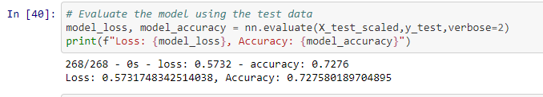
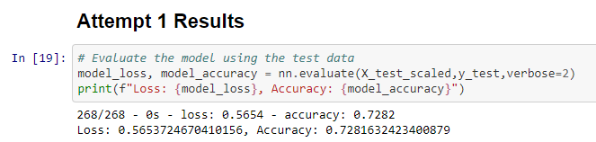
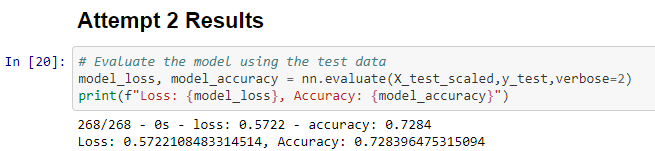
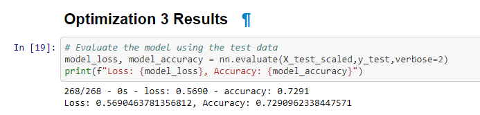

# Neural Network Charity Analysis

## Overview
The purpose of this analysis is to create a binary classifier, using machine learning and neural networks, that is capable of which funding applicants will be successful.

## Results

Data Preprocessing
* The target for the model was the data within the "IS_SUCCESSFUL" column.

* The features for the model were all columns other than "IS_SUCCESSFUL".

* "EIN" and "NAME" were removed from the dataset during data preprocessing.

Compiling, Training, and Evaluating the Model
* Two hidden layers were used for the initial model. This was done to help getting a more indepth learning process without potentially overfitting the model. 
* For the first layer 80 neurons were used and 30 were used for the second layer. 
* The initial model used relu functions for the hidden layers to help standardize and simplify the output. Sigmoid was used for the output layer so that it could classify with a 0 or 1.
* I was not able to achieve target performance of 75%, although the model came close.

* For the first attempt at optimization I increased the neurons to 100 and 50.

* For the second attempt at optimization I added a hidden layer.

* For the third attempt I changed the activation function for the first hidden layer to tahn.

## Summary
The best result achieved was Attempt 3 with an accuracy of 72.9%. Each attempt at optimization increased the accuary slightltly. To help solve the classification problem I believe more time should be spent looking at potentially noisy data within the dataset. 
